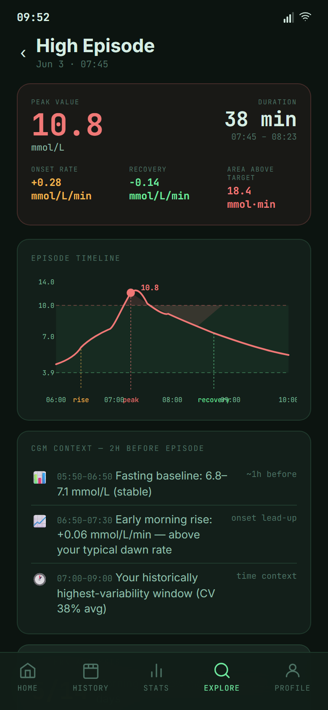
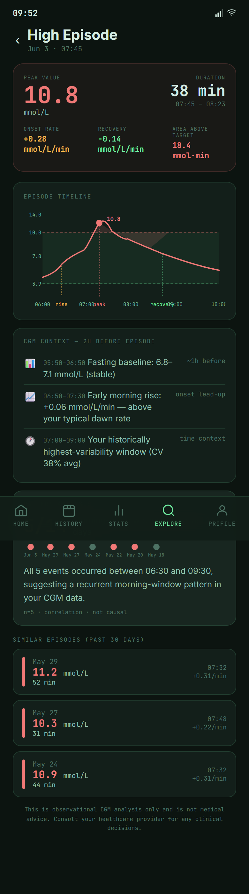

# High Episode

High Episode is a detail page opened from History when a sustained high glucose event needs more context.

It focuses on one event: when it started, how high it went, how long it lasted, and what the surrounding curve looked like.

{ width=320 }

---

## Planned Purpose

History shows the day. High Episode lets users zoom into one high event without losing the surrounding context.

The page is useful for retrospective review after a difficult day. It is not a real-time safety feature and does not recommend treatment changes.

---

## What It Shows

{ width=320 }

| Section | Purpose |
|---|---|
| Episode summary | Start time, duration, peak, and recovery context |
| Episode chart | The event with surrounding readings before and after |
| Event context | A short explanation of what made this episode notable |

---

## How To Get Here

- Open [History](../planned-features/history.md).
- Find a high episode callout or rose marker.
- Open the High Episode detail page for that event.

---

## Feedback Needed

- What information matters most when reviewing a high event?
- Is the chart context enough, or should more surrounding time be shown?
- Are the labels clear for non-clinical users?
- What safety wording should be included so this remains a review tool?

---

## Related

- [History](../planned-features/history.md) - return to the full-day review
- [Low Episode](low-episode.md) - the equivalent detail page for lows
- [Stats](../planned-features/stats.md) - review aggregate time-above-range metrics
