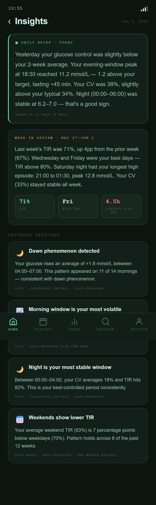

# Insights

Plain-language summaries for the CGM data users already collect with [xDrip+](https://github.com/NightscoutFoundation/xDrip) or [Nightscout](https://nightscout.github.io/).

Insights is opened from the Home screen. Home gives a short summary; Insights gives more room for the daily brief, weekly review, and pattern cards.

{ width=320 }

---

## Planned Purpose

Insights is meant to help users answer:

- What should I notice today?
- How does this week compare with my own recent data?
- Are there repeated patterns worth reviewing in History or Stats?

It does not provide medical advice, treatment recommendations, or automated decisions. The goal is to make review easier, not to replace the user's existing CGM workflow.

---

## What It Shows

{ width=320 }

| Section | Purpose |
|---|---|
| Daily brief | A short summary of the most notable recent glucose pattern |
| Weekly review | A readable recap of recent TIR, variability, and events |
| Pattern cards | Repeated patterns that may be useful to review |

---

## How To Use It

- Start from Home when the summary looks useful.
- Open Insights when you want the longer explanation behind the Home summary.
- Use History when an insight points to a specific difficult day.
- Use Stats when an insight points to a broader multi-day pattern.

---

## Feedback Needed

- Is the language clear enough for everyday CGM review?
- Which summaries are useful, and which feel unnecessary?
- Should the first version be more conservative about showing patterns?
- What wording would feel respectful and helpful to xDrip+ and Nightscout users?

---

## Related

- [Home](../planned-features/home.md) - where the short insight summary appears
- [History](../planned-features/history.md) - review a specific day
- [Stats](../planned-features/stats.md) - review broader trends and metrics
