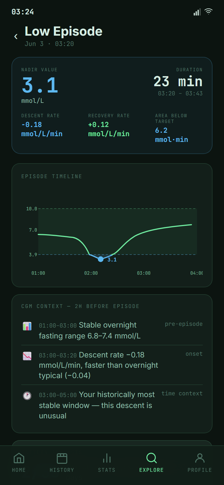
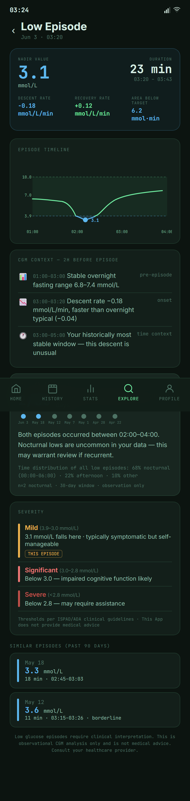

# Low Episode

Low Episode is a detail page opened from History when a sustained low glucose event needs more context.

It focuses on one event: when it started, how low it went, how long it lasted, and how the surrounding curve recovered.

{ width=320 }

---

## Planned Purpose

History shows the day. Low Episode lets users zoom into one low event without losing the surrounding context.

The page is useful for retrospective review, especially when lows happen overnight or are easy to miss. It is not a real-time emergency guide and does not replace a user's care plan.

---

## What It Shows

{ width=320 }

| Section | Purpose |
|---|---|
| Episode summary | Start time, duration, nadir, and recovery context |
| Episode chart | The event with surrounding readings before and after |
| Event context | A short explanation of what made this episode notable |

---

## How To Get Here

- Open [History](../planned-features/history.md).
- Find a low episode callout or blue marker.
- Open the Low Episode detail page for that event.

---

## Safety Note

This page is for reviewing past events. If a user is experiencing a low right now, they should follow their healthcare provider's plan and not rely on this app for real-time treatment guidance.

---

## Feedback Needed

- What information matters most when reviewing a low event?
- Should nocturnal lows be labeled differently?
- Is the recovery context easy to understand?
- What safety wording should be included so this remains a review tool?

---

## Related

- [History](../planned-features/history.md) - return to the full-day review
- [High Episode](high-episode.md) - the equivalent detail page for highs
- [Stats](../planned-features/stats.md) - review aggregate time-below-range metrics
