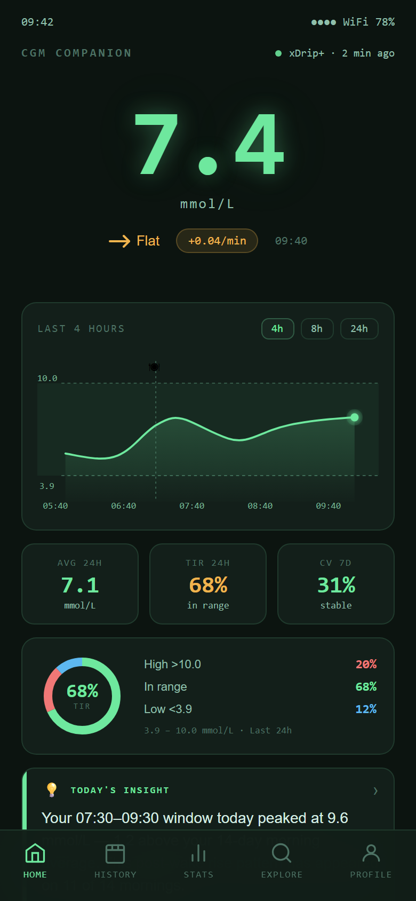

# SmartXDrip

FOR XDRIP+ · NIGHTSCOUT · COMMUNITY REVIEW

# Already using [xDrip+](https://github.com/NightscoutFoundation/xDrip) or [Nightscout](https://nightscout.github.io/)?

SmartXDrip is a planned companion app for CGM review and analysis. It starts from respect for the work already done by <a href="https://github.com/NightscoutFoundation/xDrip">xDrip+</a> and <a href="https://nightscout.github.io/">Nightscout</a>. Not another CGM source. Not a replacement. The current public review starts with Home, History, and Stats views, then future features will be shaped step by step based on community feedback and real user needs.

[View product plan](product-plan.md){ .md-button .md-button--primary }
[Preview features](planned-features/home.md){ .md-button }

  

    
<a href="https://github.com/NightscoutFoundation/xDrip">xDrip+</a>

    
Android data source

  

  

    
<a href="https://nightscout.github.io/">Nightscout</a>

    
Cloud/self-hosted source

  

  

    
3

    
First planned features

  

  

    
Feedback

    
Before development hardens

  

---

First planned screens

## Home, History, and Stats

Home

What is happening with my glucose today?

History

What happened on a specific day?

Stats

What patterns are emerging over time?

---

What this is

## For people already using [xDrip+](https://github.com/NightscoutFoundation/xDrip) or [Nightscout](https://nightscout.github.io/)

SmartXDrip is planned as a companion review and analysis workspace for CGM data already collected by [xDrip+](https://github.com/NightscoutFoundation/xDrip) or [Nightscout](https://nightscout.github.io/).

The existing tools remain central: [xDrip+](https://github.com/NightscoutFoundation/xDrip) handles Android CGM workflows, while [Nightscout](https://nightscout.github.io/) gives users and families control over their CGM data site and sharing model. SmartXDrip is meant to sit beside those workflows.

It may be useful if you:

- use [xDrip+](https://github.com/NightscoutFoundation/xDrip) as your Android CGM hub
- use [Nightscout](https://nightscout.github.io/) as your personal or family CGM data site
- want a dedicated daily review space alongside existing alert workflows
- care about Time in Range, history, variability, and recurring patterns
- want xDrip+ or Nightscout to remain the source of truth

The app would help users answer everyday questions:

- What is happening with my glucose right now?
- How did today compare with recent days?
- Which days or time windows are repeatedly difficult?
- Are my Time in Range, average glucose, and variability improving?

SmartXDrip would not read CGM sensors directly, replace xDrip+, replace Nightscout, replace existing alert and safety workflows, or provide medical advice.

---

First planned release

## What each screen tries to solve

01 · HOME

Current glucose overview

A focused first screen for the latest reading, short-term trend, today's Time in Range, and one plain-language summary.

<a class="sx-feature-link" href="planned-features/home/">Preview Home</a>

02 · HISTORY

Day-by-day review

A daily timeline for reviewing glucose curves, high/low events, and what happened on a specific day.

<a class="sx-feature-link" href="planned-features/history/">Preview History</a>

03 · STATS

Statistics summary

Time in Range, average glucose, variability, range breakdown, and visual summaries across 7 to 90 days.

<a class="sx-feature-link" href="planned-features/stats/">Preview Stats</a>

---

## Why publish this now?

This repository is being published before the product is finalized so xDrip+ and Nightscout users can react to the direction early.

The most useful feedback right now is:

- Whether Home / History / Stats are the right starting point
- Whether the screenshots show information in a useful order
- Whether xDrip+ and Nightscout users expect a different review workflow
- Which terms are confusing for non-clinical users
- What safety language needs more detail
 
---

## Give feedback

SmartXDrip is being shaped around real xDrip+ and Nightscout workflows. Join one of the focused discussions:

- [Home: What would you want to see first?](https://github.com/solgosea/smartxdrip-docs/discussions/1)
- [History: How do you review a difficult CGM day?](https://github.com/solgosea/smartxdrip-docs/discussions/2)
- [Stats: Which CGM statistics actually help?](https://github.com/solgosea/smartxdrip-docs/discussions/3)

---

## Respecting the existing ecosystem

SmartXDrip should fit into the [xDrip+](https://github.com/NightscoutFoundation/xDrip) and [Nightscout](https://nightscout.github.io/) ecosystem without competing with the tools users already rely on.

- [xDrip+](https://github.com/NightscoutFoundation/xDrip) remains the Android data hub and sensor-facing tool.
- [Nightscout](https://nightscout.github.io/) remains the user-controlled CGM site and sharing layer.
- SmartXDrip remains a companion app focused on review, interpretation, and feedback-friendly summaries.

---

!!! warning "Medical disclaimer"
    SmartXDrip is planned as a personal data review tool, not a medical device.
    Nothing in this app should be treated as medical advice. Do not make treatment,
    medication, or dietary decisions based solely on what the app shows.
    Always consult your healthcare provider.
