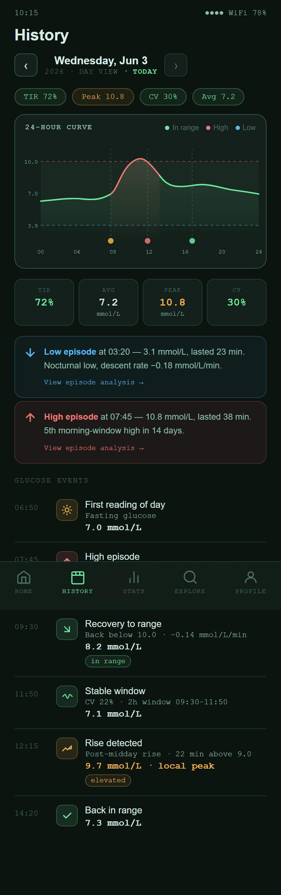

# Planned Feature: History

History is planned as a day-by-day review screen.

It should help users look back at a specific day and understand what happened without digging through raw CGM entries.

{ width=320 }

---

## Planned purpose

The History screen would show data already collected by [xDrip+](https://github.com/NightscoutFoundation/xDrip) or [Nightscout](https://nightscout.github.io/):

- A selected date
- A full-day glucose curve
- Daily Time in Range
- Average glucose
- High and low event markers
- A timeline of detected events

The goal is to make retrospective review easier, especially after difficult days, while leaving [xDrip+](https://github.com/NightscoutFoundation/xDrip) or [Nightscout](https://nightscout.github.io/) as the original data source.

---

## Full-screen preview

{ width=320 }

---

## Feedback needed

Useful feedback for this screen:

- Is a daily review the right structure?
- Should event detection be included in the first version?
- What details matter most when reviewing a high or low day?
- Should users be able to add notes for meals, exercise, or medication?
- What would make this more useful than looking at the source app alone?
