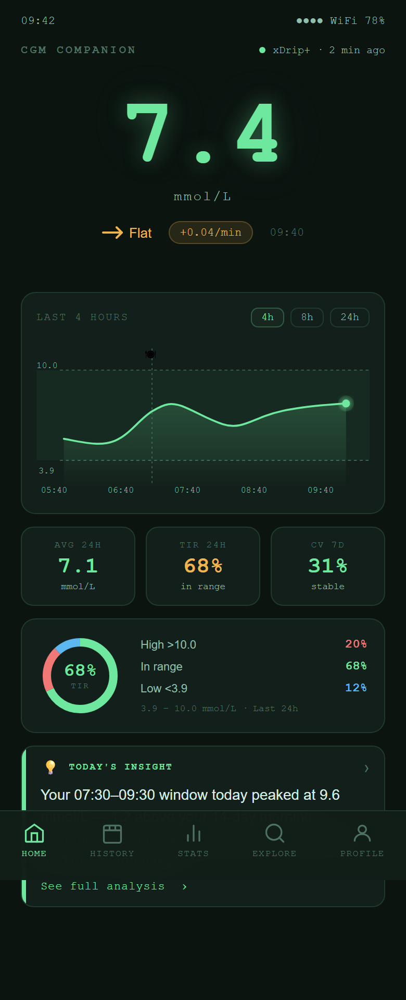

# Planned Feature: Home

Home is planned as the first review screen users see when they open SmartXDrip.

It should answer one question quickly: **what is happening with my glucose right now?**

{ width=320 }

---

## Planned purpose

The Home screen would combine current-day signals from data already collected by [xDrip+](https://github.com/NightscoutFoundation/xDrip) or [Nightscout](https://nightscout.github.io/):

- Latest CGM reading
- Trend direction
- Short 4-hour curve
- Today's Time in Range
- Average glucose and variability
- A simple one-line summary

The goal is not to replace source-app views or alerts. The goal is to give [xDrip+](https://github.com/NightscoutFoundation/xDrip) and [Nightscout](https://nightscout.github.io/) users a companion place to review the day.

---

## Full-screen preview

{ width=320 }

---

## Feedback needed

Useful feedback for this screen:

- Is this the right information for the first screen?
- Is anything too clinical or too hard to understand?
- Should the chart focus on 4 hours, 6 hours, or the full day?
- Is the one-line summary useful, or should it be removed?
- What would xDrip+ users expect to see here that is missing?
