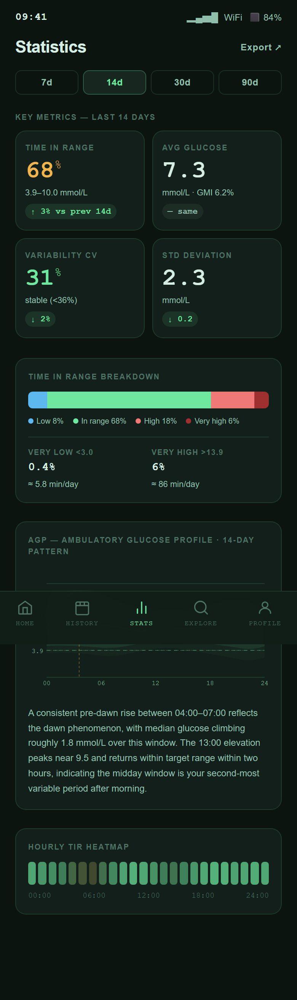

# Planned Feature: Stats

Stats is planned as a readable summary of glucose patterns across multiple days.

It should help users understand whether their glucose control is improving, stable, or getting harder to manage.

{ width=320 }

---

## Planned purpose

The Stats screen would summarize:

- Time in Range
- Average glucose
- Coefficient of Variation
- Standard deviation
- Range breakdown
- AGP-style daily pattern
- Hourly Time in Range heatmap

The goal is to make common CGM metrics easier to interpret for everyday use.

---

## Full-screen preview

{ width=320 }

---

## Feedback needed

Useful feedback for this screen:

- Are TIR, average, CV, and SD the right headline metrics?
- Should AGP be included in the first release or later?
- Is the heatmap understandable for non-technical users?
- Which time windows matter most: 7 days, 14 days, 30 days, or 90 days?
- What statistics are useful without turning the app into a clinical dashboard?
